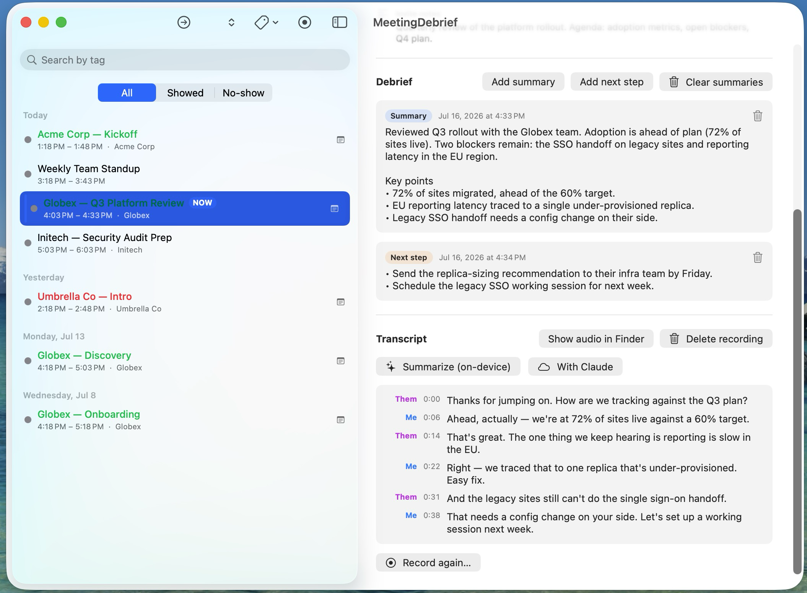

# MeetingDebrief

A native macOS app that turns your calendar into a meeting-intelligence workflow:
it watches your meetings, prompts you for a debrief the moment each one ends,
optionally records and transcribes calls **on-device**, and keeps a searchable,
client-organized history of everything you captured.

Everything runs locally. The only feature that ever sends data off your Mac is
the optional "Summarize with Claude" button — and only when you click it.


> Personal project, shared as-is. It is not notarized or code-signed for
> distribution — you build and run it yourself (see [Build & run](#build--run)).
> **Recording meetings has legal and policy implications** — see
> [Recording & consent](#recording--consent) before pointing it at real calls.

---

## Screenshots



_A meeting's debrief notes, the Me/Them transcript, and the on-device / Claude
summarize buttons. Screenshots use built-in demo data — no real calendar or
client information. See [docs/screenshots/](docs/screenshots/) to regenerate the
full set (main window, popup, settings)._

## What it does

- **End-of-meeting debrief popup.** When a meeting ends, a floating panel jumps
  on screen (above everything, even full-screen apps) and offers **Summary** /
  **Next step** / **Snooze**, plus a one-click **"Client showed up? Yes /
  No-show"**. Snooze (5/10/15/30 min) is there for calls that run over.
- **Meeting browser.** A sidebar lists your meetings across a configurable
  window (default: last month → next 7 days), grouped by day, with live search,
  attendance and tag filters, and a **NOW / NEXT** highlight that tracks the
  clock so you always see where you are in the day.
- **Per-meeting detail.** Time, calendar, location, organizer, attendees with
  accept/decline status, invite notes, detected **client**, **tags**, all your
  debrief notes, a **Previous meetings** panel (this client's history, click to
  jump), and the transcript.
- **On-device recording & transcription (opt-in).** Captures your mic and the
  other participants' audio as two streams, transcribes locally, and merges
  them into a **Me / Them** timeline. Nothing leaves the Mac.
- **AI summaries.** From a transcript, generate a summary **plus suggested next
  steps** — either fully on-device (Apple Intelligence) or via the Claude API
  for higher quality. Results are saved as normal debrief entries.
- **Client organization.** Clients are auto-detected from attendee email
  domains; tags (typically client names) let you group and filter; history
  matches by tag → domain → title, so a renamed recurring meeting still links
  to its past occurrences.
- **Handles calendar reality.** Merges double-booked entries (your personal
  time-blocker + the real invite), skips declined/cancelled/all-day events, and
  refreshes every 5 minutes so deletions and new invites show up on their own.

All debrief data is stored as plain files in `~/Documents/MeetingDebrief/`
(JSON as the source of truth, plus a human-readable markdown export per day), so
it's greppable and yours.

---

## How it reads your calendar

The app reads the **macOS Calendar database via EventKit**. Any account you've
added under **System Settings → Internet Accounts** — Exchange/Outlook work
calendars, iCloud, Google — is visible automatically. There is **no Microsoft
Graph / OAuth integration and no server component**; if your calendar shows up
in Apple Calendar, MeetingDebrief sees it.

If your events live *only* in the Outlook desktop app and are not synced to
macOS, add the account under Internet Accounts (it does not replace Outlook —
both read the same Exchange calendar).

---

## Requirements

- macOS 14 (Sonoma) or later. **macOS 26+** is recommended — it unlocks the
  modern long-form transcription engine (`SpeechAnalyzer`) and on-device
  summaries (Apple Foundation Models).
- Xcode command-line tools (`swift`) to build.
- Apple Silicon + Apple Intelligence enabled, for on-device summaries.
- An Anthropic API key, only if you want the "Summarize with Claude" option.

---

## Install a downloaded build

A prebuilt **universal** `.app` (Apple Silicon + Intel) is attached to each
[GitHub Release](../../releases). It is **not notarized** — it's an open-source
personal project, not a paid Apple-distributed app — so macOS Gatekeeper will
warn you the first time you open it. This is expected; here's how:

1. Download `MeetingDebrief.zip` from the latest release and unzip it (double-click).
2. **Right-click** `MeetingDebrief.app` → **Open** → **Open** in the dialog.
   (A plain double-click only offers "Move to Trash" — you must use right-click → Open.)
3. If that's blocked (common on managed/corporate Macs), run once in Terminal:
   ```sh
   xattr -dr com.apple.quarantine /path/to/MeetingDebrief.app
   ```
   then open it normally.

On first launch, grant **Calendar** access when asked. Prefer building from
source? See below — a source build has no Gatekeeper prompt.

## Build & run

```sh
./build.sh
open dist/MeetingDebrief.app
```

`build.sh` compiles a release binary with SwiftPM and assembles
`dist/MeetingDebrief.app`. It signs with your **Apple Development** certificate
if you have one (recommended — see [Code signing](#code-signing-matters)),
otherwise falls back to an ad-hoc signature.

To produce a distributable artifact (universal binary, ad-hoc signed, zipped for
a GitHub Release) run `./release.sh`, which writes `dist/MeetingDebrief.zip`.

On first launch, macOS will ask for **Calendar** access — click *Allow Full
Access*. The menu bar gains a calendar icon (today's remaining meetings, a
**Test popup** to try the flow, and quick settings). Closing the main window
keeps the app alive in the menu bar so debrief popups still fire; reopen from
the Dock or the menu bar item.

### Launch at login

System Settings → General → Login Items → **+** → select
`dist/MeetingDebrief.app`.

---

## Using it

### Debrief popup
When a meeting ends you get the panel. Keyboard: **⌘1** Summary, **⌘2** Next
step, **⌘↩** Save, **Esc** Skip. After saving one kind it offers the other.
Each meeting prompts only once (remembered across restarts); a meeting that
ended within 10 minutes of launch still gets its popup.

### Attendance
Mark **Yes / No-show** in the popup or the detail view. Titles turn green
(showed) / red (no-show) in the list; the segmented filter and toolbar isolate
them. Stored in `attendance.json`.

### Tags & clients
The detail header shows the auto-detected **client** (dominant external
attendee domain) and a **Tags** field with one-click suggestions. Filter the
list by tag from the toolbar menu or the search box. Configure which domains
count as "internal" (yours, not a client's) in **Settings → Client detection**.

### Recording & transcription
Turn on **Auto-record meetings** (Settings or menu bar). Recording starts at
each meeting's start and stops when the debrief popup fires; you can also
**Record this meeting now** from the detail view. Files land in
`~/Documents/MeetingDebrief/recordings/`. Transcription runs on-device and
produces the Me/Them timeline; re-run or run it manually with **Transcribe
recording**. Settings offers **weekdays-only** auto-record and an
echo-cancellation toggle (see [Audio notes](#audio-notes)).

### Summaries
With a transcript present, the detail view shows **Summarize (on-device)** and
**With Claude**. Both write a **Summary** entry and, if the meeting produced
any, a **Next step** entry. For Claude, set your key in **Settings → Claude API**
(stored in the macOS Keychain; the `ANTHROPIC_API_KEY` environment variable
also works when launched from a terminal). Rough cost: ~$0.10–0.17 per
hour-long meeting on `claude-opus-4-8`.

---

## Recording & consent

Recording captures your microphone and your Mac's system audio (the other
participants). macOS shows the purple recording indicator while it's active.
**Recording calls is regulated** — consent requirements vary by jurisdiction
(one-party vs. all-party consent) and many employers have their own policy on
recording internal and customer meetings. Confirm you're allowed to record, and
notify participants where required, before enabling this on real calls. Auto-
record is **off by default**.

---

## Audio notes

The recording pipeline is designed to be *acoustically invisible* to Webex,
Teams, Zoom, etc. — nothing is inserted into the microphone path or the system
output path by default, so you don't sound degraded to the far end. Two Settings
toggles exist for edge cases:

- **Echo-cancel microphone** (off by default): keeps participants' voices out of
  your "Me" stream on speaker calls, but it lowers your system volume while
  recording and can degrade your voice on Teams. Left off, speaker bleed into
  "Me" is instead cleaned up automatically at transcription time.
- **Use audio tap for system audio** (off by default): avoids the
  screen-recording permission but interferes with conference-app echo
  cancellation — not recommended.

See [ARCHITECTURE.md](ARCHITECTURE.md) for the full reasoning behind these.

---

## Data & privacy

Everything is stored under `~/Documents/MeetingDebrief/`:

| File | Contents |
|------|----------|
| `entries.json` | Debrief notes (source of truth) |
| `attendance.json` | Per-meeting showed/no-show |
| `tags.json` | Per-meeting tags |
| `YYYY-MM-DD.md` | Human-readable daily export |
| `recordings/<key>/*.m4a` | Audio, if recorded |
| `recordings/<key>/transcript.json` | Transcript |

Transcription and on-device summaries never touch the network. The Claude
summary button is the only outbound call, and only on demand. API keys live in
the Keychain, never on disk in the repo or notes.

---

## Code signing matters

macOS ties privacy permissions (Calendar, Microphone, Screen & System Audio
Recording) to the app's **code signature**. An ad-hoc signature changes on every
build, so macOS silently revokes granted permissions after each rebuild. Signing
with a stable **Apple Development** identity (free with any Apple ID via Xcode)
avoids this — `build.sh` uses it automatically if present. See
[ARCHITECTURE.md](ARCHITECTURE.md#permissions--code-signing) for details.

---

## Repository layout

```
Sources/MeetingDebrief/   Swift source (see ARCHITECTURE.md for the module map)
assets/AppIcon.icns        App icon (generated from tools/make-icon.swift)
tools/                     Icon generator + diagnostic scripts
build.sh                   Compile + assemble + sign the .app
Package.swift              SwiftPM manifest
Info.plist                 Bundle metadata + privacy usage strings
```

---

## License

MIT — see [LICENSE](LICENSE).
